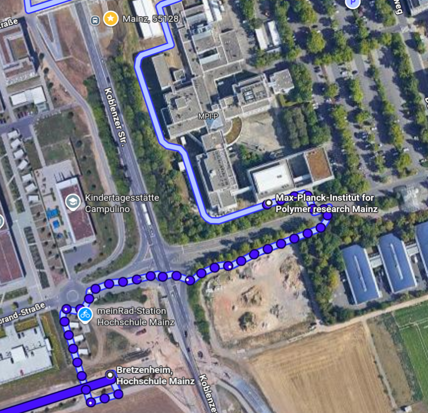

<style>
#contact h4 { font-size: 1rem; margin-bottom: 0.5rem; font-weight: 400; }
</style>

:::{#contact}

####  &nbsp; litmany@mpip-mainz.mpg.de

####  &nbsp; +49 6131 379-380

####  &nbsp; MPI for Polymer Research <br> Ackermannweg 10, 55128 Mainz, Germany

####  &nbsp; [How to reach us](#how-to-reach)

:::

<br>

```{=html}
<iframe
  src="https://www.openstreetmap.org/export/embed.html?bbox=8.21%2C49.98%2C8.25%2C49.999&layer=mapnik&marker=49.9891189%2C8.2299197"
  width="100%" height="400"
  style="border: 1px solid #ccc; border-radius: 6px;"
  allowfullscreen>
</iframe>
<p style="font-size:0.8rem; color:#666; margin-top:0.4rem;">
  <a href="https://www.openstreetmap.org/?mlat=49.9891189&mlon=8.2299197" target="_blank">View larger map</a>
</p>
```

## How to reach us {#how-to-reach}

By **tram**, take lines 51, 53, or 59 from *Hauptbahnhof West* (below the highway) and exit at *Bretzenheim/Hochschule Mainz*. From there it is a short ~200 m walk to the institute entrance (see map below).

Alternatively, **bus 75** stops at *Duesbergweg*, less than 100 m from the main entrance.

Upon arrival, please announce yourself at reception and ask them to call office number **380**.

Further travel information is available on the [MPIP directions page](https://www.mpip-mainz.mpg.de/en/directions).

{width=80% fig-align="center"}
