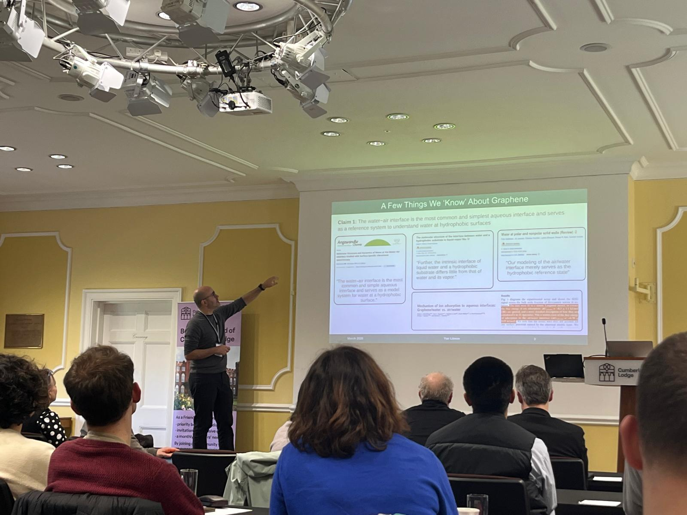
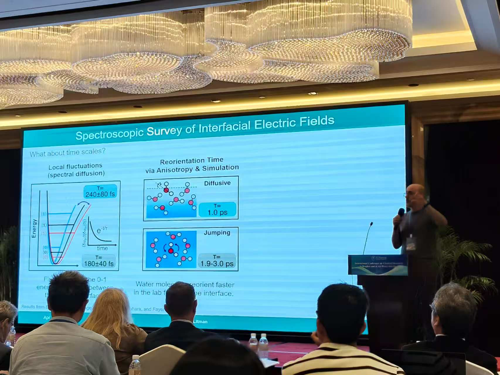
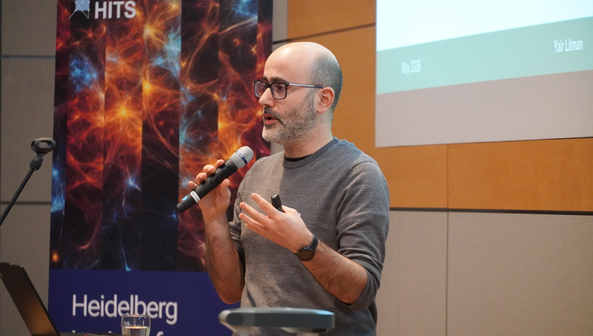
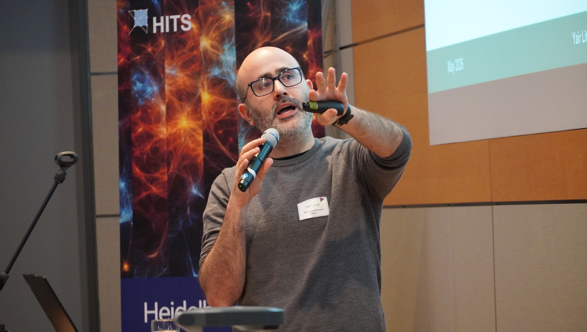
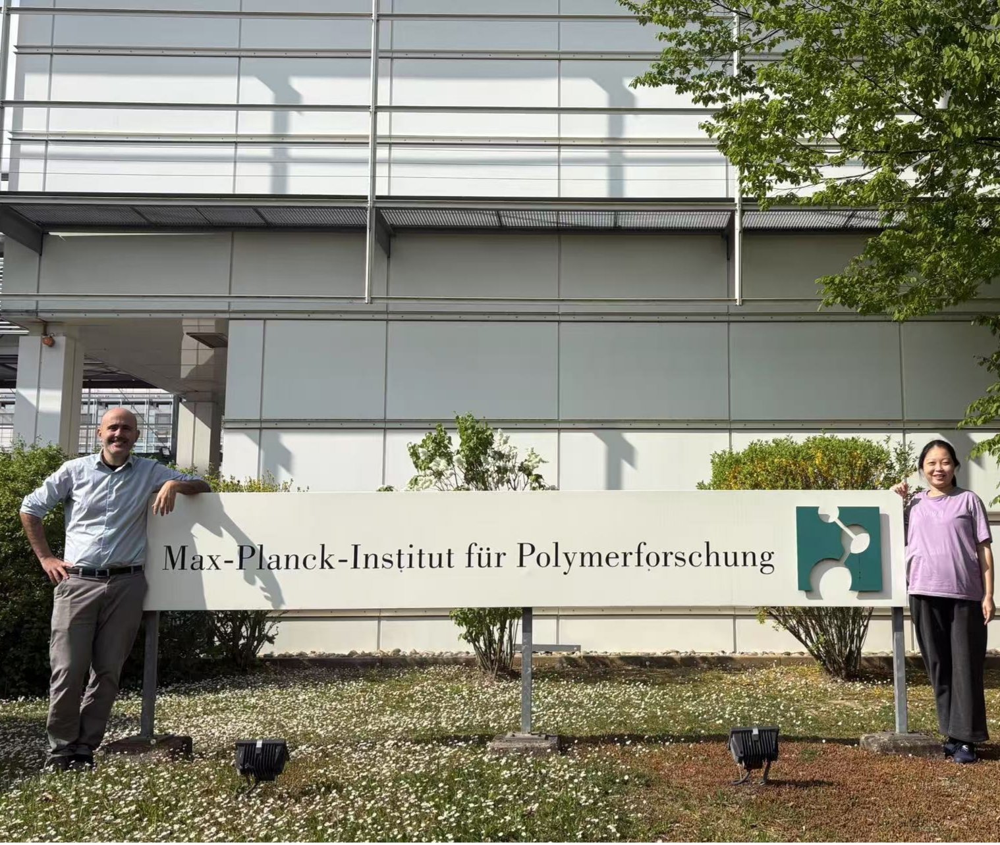
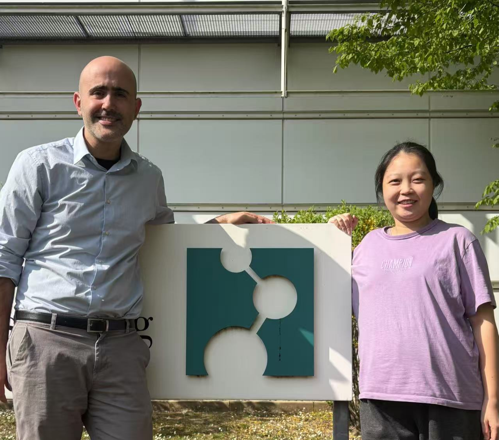

```{=html}
<div class="photo-grid">

  <div class="photo-item">
    
    <p>Naqua workshop, Windsor 2026</p>
  </div>

  <div class="photo-item">
    
    <p>Chemical reactivity on droplets and air/water interface (Shanghai, 2026)</p>
  </div>

  <div class="photo-item">
    
    <p>Simplaix Workshop (Heidelberg 2026)</p>
  </div>

  <div class="photo-item">
    
    <p>Simplaix Workshop (Heidelberg 2026)</p>
  </div>

  <div class="photo-item">
    
    <p>STREAM group, May 2025</p>
  </div>

  <div class="photo-item">
    
    <p>STREAM group, May 2025</p>
  </div>

  <div class="photo-item">
    
    <p>Evidence that theory can be fun</p>
  </div>

  <div class="photo-item">
    
    <p>Psi-k 2025 Conference (Lausanne 2025)</p>
  </div>

  <div class="photo-item">
    
    <p>Yair at "At the interface between confusion and insight"</p>
  </div>

</div>
```
