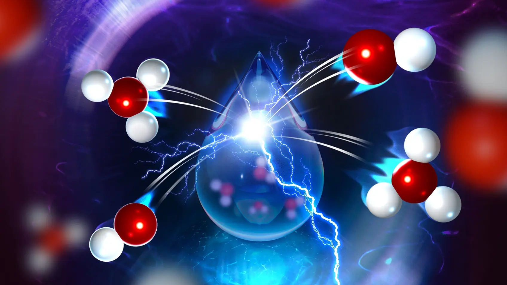

```{=html}
<div style="position: relative; width: 100%; overflow: hidden; max-height: 500px; margin-bottom: 2rem;">
  
  <div style="position: absolute; bottom: 1.5rem; left: 0; width: 100%;
              text-align: center; color: white; font-size: 3rem; font-weight: 700;
              letter-spacing: -0.5px; text-shadow: 0 2px 14px rgba(0,0,0,0.7);">
    STREAM group
  </div>
</div>
```

:::{.landing-content}

## Welcome to the STREAM Group website! {.welcome-heading}

We are a theory and simulation research group at Molecular Spectroscopy Deparment of the Max Planck Institute for Polymer Research in Mainz, Germany.



The STREAM Group — Simulations of Transformations at Electrochemical Aqueous Media — studies how chemical reactions occur at aqueous interfaces. Our work focuses on complex environments such as electrified interfaces, nanoconfined water, and liquid–solid boundaries, where molecular structure and dynamics control reactivity.

To address these questions, we develop and apply atomistic simulation methods based on quantum mechanics, statistical mechanics, machine-learning potentials, enhanced sampling, and path-integral techniques. We also simulate vibrational spectroscopies such as SFG, IR, Raman, and TERS to connect our theoretical predictions with experiments.

Our goal is to build a microscopic understanding of interfacial reactivity and use it to guide the design of systems relevant for energy storage and conversion.

:::{.landing-links}
<a href="mailto:yl899@cam.ac.uk" title="Email"><i class="bi bi-envelope"></i></a>
<a href="https://x.com/YairLitman" title="Twitter/X"><i class="bi bi-twitter-x"></i></a>
<a href="https://www.linkedin.com/in/yair-litman-11345b30/" title="LinkedIn"><i class="bi bi-linkedin"></i></a>
[](https://orcid.org/0000-0002-6890-4052){title="ORCID"}
[](https://scholar.google.de/citations?user=TZ9_wnEAAAAJ&hl=en){title="Google Scholar"}
:::

:::
